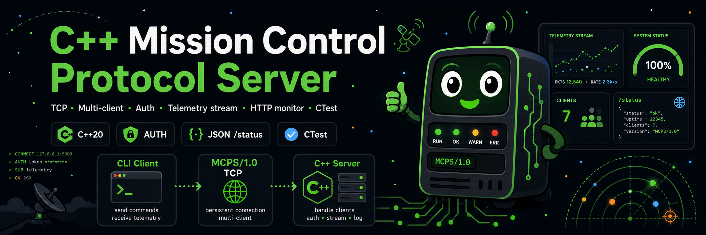

# cpp-mission-control-protocol-server


*Banner generate by ChatGPT*

A C++20 Linux Mission Control Protocol Server exposing a simple command/control protocol over TCP, with multi-client handling, authentication, structured logs, parser tests, a CLI client and a small HTTP monitoring endpoint.

## Why this project exists

This project is a compact systems/software-engineering exercise inspired by industrial mission-control and command/monitoring software. It bridges API-style command handling with lower-level Linux networking, C++ architecture, reliability and testability.

## Features

- TCP server accepting multiple clients concurrently.
- Line-oriented Mission Control Protocol (MCPS/1.0).
- Commands: `CONNECT`, `AUTH <token>`, `GET_STATUS`, `START_STREAM`, `STOP_STREAM`, `SET_MODE SAFE|ACTIVE|MAINTENANCE`, `PING`, `HELP`, `QUIT`.
- Simple token authentication before privileged commands.
- Per-client telemetry stream mode.
- Thread-safe server state using `std::atomic`, `std::mutex` and RAII wrappers.
- One `std::jthread` accept loop, one `std::jthread` per client and one optional monitor thread.
- Command parser and processor separated from networking for unit testing.
- CLI client for scripted or interactive sessions.
- HTTP monitor exposing `/status` as JSON and a minimal HTML dashboard.
- CMake + CTest based tests with no external dependency.

## Build

```bash
cmake -S . -B build -DCMAKE_BUILD_TYPE=Release
cmake --build build -j
ctest --test-dir build --output-on-failure
```

For strict compilation:

```bash
cmake -S . -B build-werror -DCMAKE_BUILD_TYPE=Release -DMCPS_WARNINGS_AS_ERRORS=ON
cmake --build build-werror -j
ctest --test-dir build-werror --output-on-failure
```

## Run the server

```bash
./build/mcps_server \
  --host 0.0.0.0 \
  --port 5555 \
  --token mission-secret \
  --monitor-port 8080 \
  --log-file mcps.log
```

The server stops cleanly on `SIGINT` or `SIGTERM`.

## Use the CLI client

Send one command:

```bash
./build/mcps_client --host 127.0.0.1 --port 5555 --token mission-secret --command GET_STATUS
```

Set the mission mode:

```bash
./build/mcps_client --command "SET_MODE ACTIVE"
```

Receive telemetry events for three seconds:

```bash
./build/mcps_client --stream-seconds 3
```

Start an interactive session:

```bash
./build/mcps_client
```

## HTTP monitoring

Open the dashboard:

```bash
curl http://127.0.0.1:8080/
```

Read JSON status:

```bash
curl http://127.0.0.1:8080/status
```

Example JSON:

```json
{
  "mode": "SAFE",
  "any_stream_active": false,
  "connected_clients": 1,
  "authenticated_clients": 1,
  "active_streams": 0,
  "commands": 3,
  "protocol_errors": 0,
  "auth_failures": 0,
  "telemetry_events": 0,
  "uptime_ms": 1024
}
```

## Repository layout

```text
include/mcps/          Public C++ headers
src/                   Core implementation and server implementation
apps/                  mcps_server and mcps_client executables
tests/                 Unit tests driven by CTest
docs/                  Protocol and architecture documentation
scripts/demo.sh        End-to-end demo script
examples/              Example command session
```

## Security model

The project intentionally uses a simple bearer token because it is a simulator. Do not expose this server directly on an untrusted network without TLS, stronger authentication, authorization and rate limiting. See `docs/SECURITY.md`.
